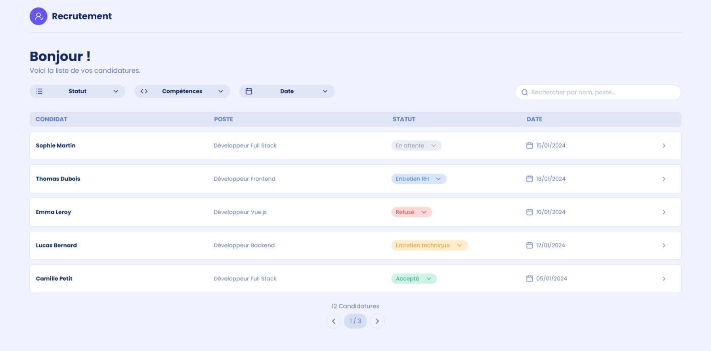
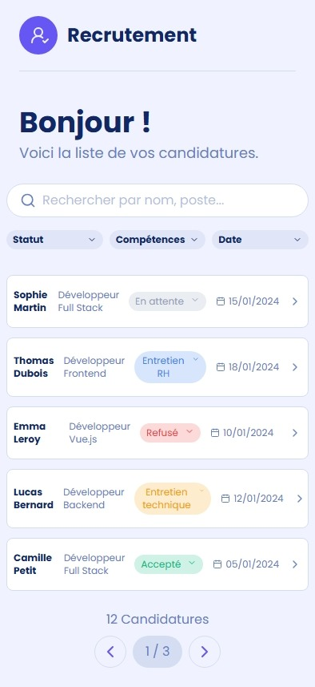
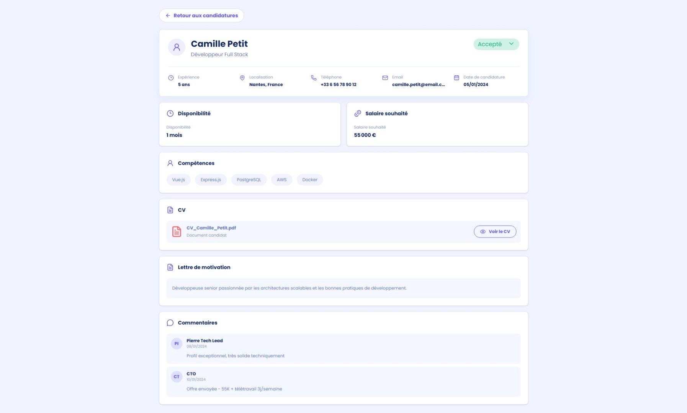
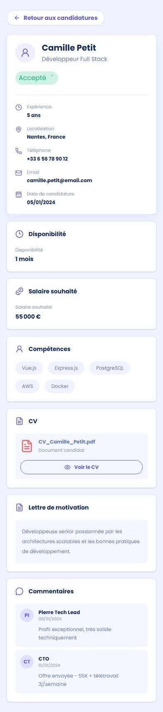

# Gestion des candidatures

Application Vue 3 de gestion de candidatures, connectée à une API REST locale fournie par JSON Server.

## Fonctionnalités

### Réalisées

- Affichage paginé des candidatures.
- Recherche par nom ou poste avec délai de 500 ms entre deux requêtes.
- Filtres par statut, compétence et date.
- Chargement des statuts depuis `GET /statuts`.
- Chargement des compétences depuis `GET /competences`.
- Page détail accessible avec `GET /candidatures/:id`.
- Modification du statut avec `PATCH /candidatures/:id`.
- États de chargement et d'erreur réseau.
- Navigation avec Vue Router.
- Interface responsive avec Tailwind CSS.


## Prérequis

- Node.js récent
- npm
- JSON Server

## Installation

Depuis la racine du projet :

```bash
npm install
npm install -g json-server
```

L'installation globale de JSON Server est nécessaire une seule fois. Le fichier `db.json` doit rester à la racine du projet.

## Lancer l'application

### Terminal 1 : API JSON Server

Depuis le dossier qui contient `db.json` :

```bash
json-server --watch db.json --port 3000
```

L'API est alors disponible sur :

```text
http://localhost:3000
```

Vérifier les données avec :

```text
http://localhost:3000/candidatures
http://localhost:3000/statuts
http://localhost:3000/competences
```

### Terminal 2 : application Vue

```bash
npm run dev
```

Ouvrir ensuite l'URL affichée par Vite, généralement :

```text
http://localhost:5173
```

Les deux terminaux doivent rester ouverts. Si le port `3000` est déjà utilisé, il faut arrêter l'ancien serveur avec `Ctrl+C` avant de le relancer.

## Endpoints utilisés

| Méthode | Endpoint | Utilisation |
| --- | --- | --- |
| `GET` | `/candidatures?_page=1&_per_page=5` | Liste paginée |
| `GET` | `/candidatures/:id` | Détail d'une candidature |
| `GET` | `/statuts` | Options de statut et couleurs |
| `GET` | `/competences` | Options de compétences |
| `PATCH` | `/candidatures/:id` | Modification du statut |

Exemple de modification :

```json
{
	"statut": "Entretien RH"
}
```


## Choix techniques

### Vue 3 et Composition API

La Composition API permet de regrouper la logique de chaque composant et de gérer les états réactifs avec `ref`, `watch` et `onMounted`.

### Pinia

Pinia centralise les candidatures, les statuts, les compétences, les états de chargement et les erreurs. Les composants restent ainsi principalement dédiés à l'affichage et aux interactions.

### JSON Server et Fetch API

JSON Server fournit une API REST locale à partir de `db.json`. Les appels sont réalisés avec `fetch`, sans données de candidature codées en dur dans les composants.

### Vue Router

Les routes principales sont :

- `/` : liste des candidatures
- `/candidature/:id` : détail d'une candidature

### Tailwind CSS

Tailwind est utilisé pour créer une interface responsive avec une palette cohérente, des cartes d'information, des badges et des états visuels.

## Problématiques et solutions

### Volume important de candidatures

La pagination limite le nombre de lignes affichées et facilite la navigation dans une liste importante.

### Recherche répétée

La barre de recherche utilise un debounce de `500 ms` afin d'éviter de déclencher une action à chaque caractère saisi.

### Mise à jour du statut

Le statut est sélectionné dans un menu puis envoyé à JSON Server avec une requête `PATCH`. La couleur du badge est récupérée depuis la ressource `/statuts`.

### Erreurs réseau

Les états `loading` et `error` sont centralisés dans Pinia. Un message utilisateur est affiché lorsque l'API est indisponible et un bouton permet de réessayer le chargement.

## Tests manuels à effectuer

1. Lancer JSON Server puis l'application Vue.
2. Vérifier l'affichage des candidatures.
3. Écrire un nom dans la recherche.
4. Tester un statut, une compétence et un tri par date.
5. Ouvrir le détail d'un candidat.
6. Changer son statut et vérifier la modification dans `db.json`.
7. Arrêter JSON Server et vérifier l'état d'erreur.
8. Recharger directement `/candidature/1` pour vérifier le chargement du détail.

## Temps passé

Les temps ci-dessous sont indicatifs et doivent être ajustés avec les temps réellement mesurés :

| Partie | Temps indicatif |
| --- | ---: |
| Installation et configuration JSON Server | 15 min |
| Analyse UX et architecture | 30 min |
| Liste, pagination et états | 1 h 30 |
| Recherche et filtres | 1 h 15 |
| Page détail et routing | 1 h |
| Mise à jour du statut | 30 min |
| Styling responsive et vérifications | 1 h |

## Captures d'écran







## Live Demo
	https://test-technique-frontend.vercel.app/


